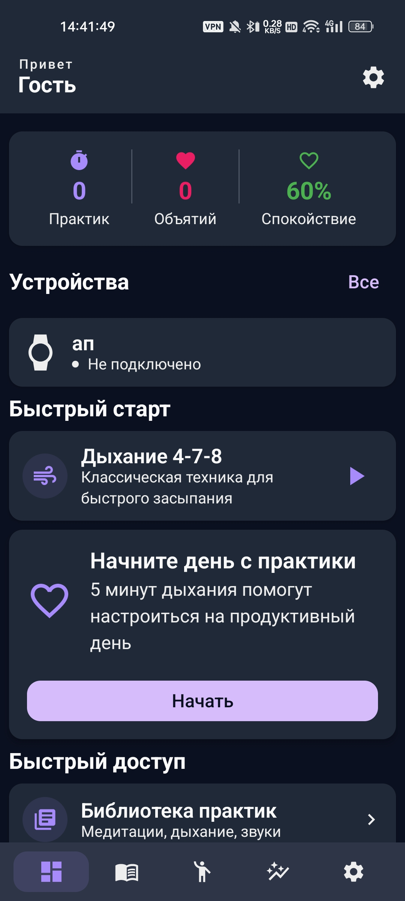
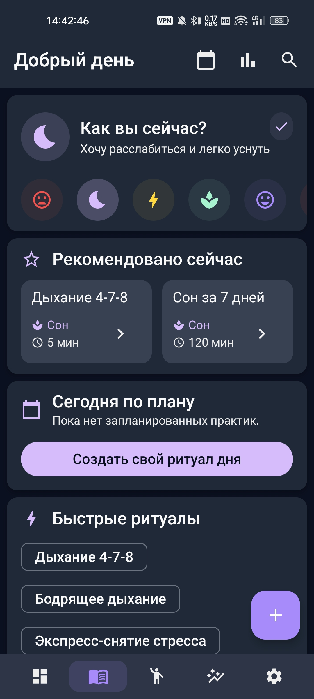
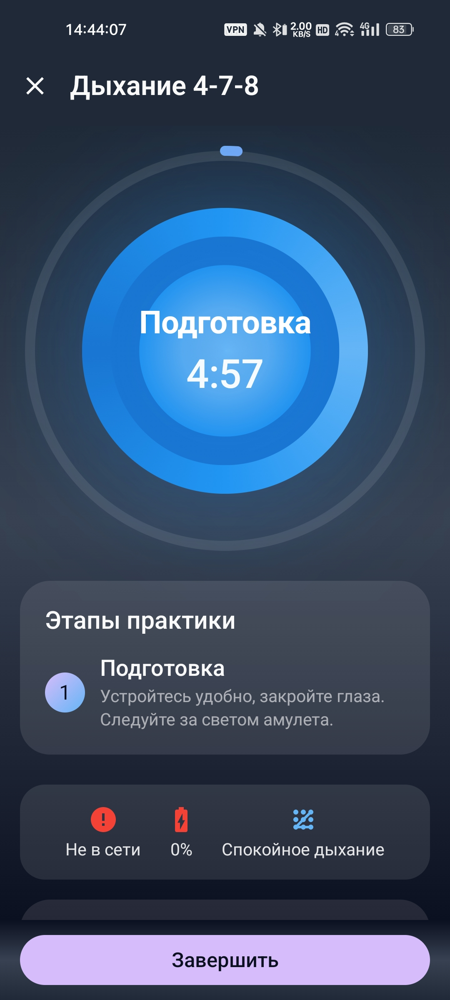
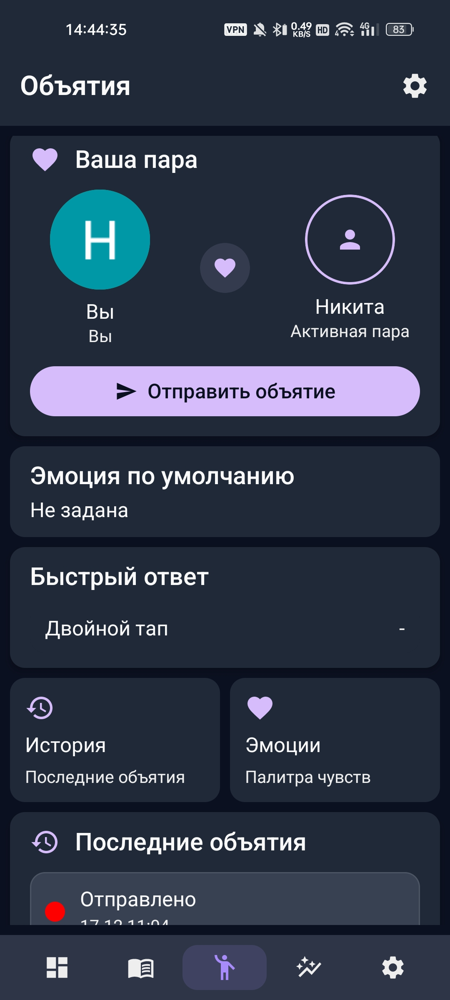
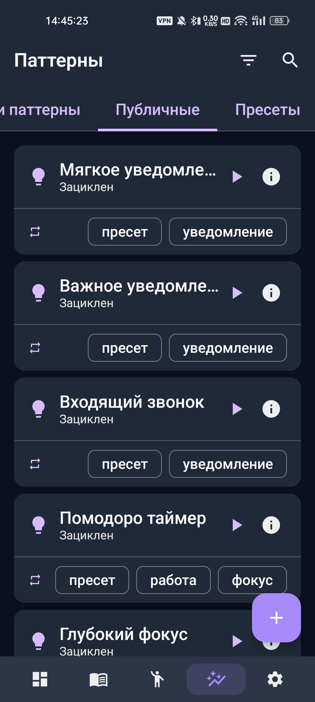
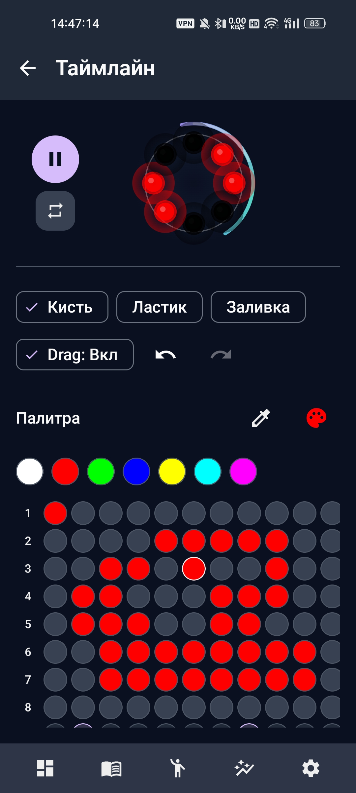

# Amulet Android App

Android‑приложение для экосистемы **Amulet**. Приложение выступает центром управления физическим устройством Amulet (BLE/NFC, OTA), а также предоставляет практики для ментального здоровья, социальные функции («объятия»), библиотеку и редактор паттернов.

## Содержание

- [Скриншоты](#скриншоты)
- [Ключевые возможности (по коду)](#ключевые-возможности-по-коду)
- [Как устроено приложение](#как-устроено-приложение)
- [Конфигурация](#конфигурация)
- [Технологический стек и архитектура](#технологический-стек-и-архитектура)
- [Требования](#требования)
- [Быстрый старт](#быстрый-старт)
- [Команды Gradle](#команды-gradle)
- [Правила модульных зависимостей](#правила-модульных-зависимостей)
- [Troubleshooting](#troubleshooting)
- [Contributing](#contributing)
- [Модульная структура](#модульная-структура)

## Скриншоты

<table>
  <tr>
    <td align="center">
      
      <br />
      <sub><b>Главный экран</b><br />быстрый старт и устройства</sub>
    </td>
    <td align="center">
      
      <br />
      <sub><b>Практики</b><br />подбор и эмоциональное состояние</sub>
    </td>
    <td align="center">
      
      <br />
      <sub><b>Сессия</b><br />таймер и этапы практики</sub>
    </td>
  </tr>
  <tr>
    <td align="center">
      
      <br />
      <sub><b>Объятия</b><br />пара и быстрые действия</sub>
    </td>
    <td align="center">
      
      <br />
      <sub><b>Паттерны</b><br />пресеты и категории</sub>
    </td>
    <td align="center">
      
      <br />
      <sub><b>Редактор</b><br />рисование таймлайна</sub>
    </td>
  </tr>
</table>

Полная галерея — в `screenshots/`.

## Ключевые возможности (по коду)

- **Практики и расписание**: поиск/детали/сессия/календарь/редактор практик (`:feature:practices`).
- **Курсы**: экран деталей курса и прогресс (часть `:feature:practices`).
- **Паттерны**: список/выбор/редактор/предпросмотр, отдельный полноэкранный редактор таймлайна (`:feature:patterns`).
- **Устройства**: список/детали/паринг (вложенный граф)/OTA (экран обновления) (`:feature:devices`).
- **Объятия**: главный экран, история, настройки, эмоции и редактор эмоции, паринг по коду, детали объятия; есть диплинки `amulet://hugs…` (`:feature:hugs`).
- **Настройки**: главный экран + профиль/приватность; переходы в устройства и hugs settings (`:feature:settings`).
- **Гостевой режим**: отдельное состояние `AuthState.Guest` в `SessionViewModel`.

## Как устроено приложение

### Точки входа

- `app/src/main/java/com/example/amulet_android_app/AmuletApp.kt` — `Application`.
  Инициализирует телеметрию, OneSignal, синхронизацию push‑токена, а также запускает `DataInitializer.initializeIfNeeded()` и `AutoConnectLastDeviceUseCase()`.
- `app/src/main/java/com/example/amulet_android_app/MainActivity.kt` — Compose‑entrypoint.
  Дополнительно восстанавливает `AmuletForegroundService`, если есть активная сессия практики.

### Сессия пользователя

UI‑корень `app/src/main/kotlin/com/example/amulet_android_app/presentation/AmuletApp.kt` переключается по состоянию `SessionViewModel`:

- `Loading` → Splash
- `LoggedOut` → стартует `AuthGraph`
- `LoggedIn`/`Guest` → стартует `DashboardGraph` и показывает `MainScaffold`

Источник истины по сессии — `UserSessionProvider.sessionContext` из `:shared`.

### Навигация

Главный `NavHost` находится в `app/src/main/kotlin/com/example/amulet_android_app/navigation/AppNavHost.kt` и включает графы:

- `dashboardGraph`
- `devicesGraph`
- `patternsGraph`
- `practicesGraph`
- `hugsGraph`
- `settingsGraph`
- `authGraph`

Примеры диплинков, определённых в feature‑навигации:

- `amulet://practices/session/{practiceId}`
- `amulet://hugs`
- `amulet://hugs/{hugId}`
- `amulet://hugs/pair?code=…&inviterName=…`

### Dependency Injection (Hilt + Koin bridge)

- DI контейнер уровня Android: **Hilt**.
- Для `:shared` (KMP) используется **Koin**.

В `app/src/main/java/com/example/amulet_android_app/di/KoinBridgeModule.kt` поднимается Koin и в него пробрасываются Android‑реализации репозиториев (`:data:*`) и провайдеры сессии.
Далее в app/feature коде usecase’ы из `:shared` получаются через `koin.get()` и выдаются наружу через `@Provides`.

### Scaffold и bottom navigation

`MainScaffold` (`app/.../navigation/MainScaffold.kt`) управляет bottom bar через `LocalScaffoldState`.
Bottom bar показывается только на route’ах, начинающихся с:

- `dashboard`
- `practices`
- `hugs`
- `patterns`
- `settings`

### Foreground‑сервис (BLE/практики/предпросмотр паттернов)

`core/foreground/.../AmuletForegroundService.kt` — foreground‑сервис, который держит работу «с амулетом» в фоне.
Сервис предоставляет binder‑интерфейс `AmuletControl`:

- запуск/остановка сессии практики
- предпросмотр паттерна на устройстве (через `GetPatternByIdUseCase` + `PreviewPatternOnDeviceUseCase`)

## Конфигурация

### `local.properties` → `BuildConfig`

`app/build.gradle.kts` читает `local.properties` и прокидывает значения в `BuildConfig`:

- `SUPABASE_URL`
- `SUPABASE_REST_URL` (по умолчанию `https://api.amulet.app/v2`)
- `SUPABASE_ANON_KEY`
- `TURNSTILE_SITE_KEY`
- `ONESIGNAL_APP_ID`

Дальше эти значения используются в рантайме:

- `SupabaseEnvironment(supabaseUrl, restUrl, anonKey)`
- `NetworkModule` строит `baseUrl` из `SupabaseEnvironment.restUrl` и добавляет заголовок `apikey: <anonKey>`
- `AuthInterceptor` добавляет `Authorization: <idToken>` (значение берётся из `IdTokenProvider`)
- `CaptchaInterceptor` добавляет `X-Captcha-Token` (одноразовый токен из `TurnstileTokenStore`)
- `OneSignalManager.initialize(BuildConfig.ONESIGNAL_APP_ID, BuildConfig.DEBUG)`

### Хранилища (DataStore)

- **Сессия пользователя приложения** хранится в proto‑DataStore `user_session.pb` (`:core:auth`).
  `UserSessionManagerImpl` преобразует данные в `UserSessionContext` и поддерживает гостевой режим.
- **Сессия Supabase** хранится в Preferences DataStore `supabase_session` (`:core:supabase`).
  Используется `SupabaseAuthSessionManager` и `SupabaseSessionStorage`.

### Push‑уведомления (OneSignal)

- `OneSignalManager` обрабатывает foreground‑уведомления и клики; по клику открывает диплинк `amulet://hugs` или `amulet://hugs/{hugId}`.
- `PushTokenSyncManager` подписывается на `playerId()` и вызывает `SyncPushTokenUseCase` из `:shared`.

### Outbox‑синхронизация (WorkManager)

`WorkManagerOutboxScheduler` ставит уникальную работу `outbox_sync` (`ExistingWorkPolicy.KEEP`) через `OutboxWorker`.
Work request создаётся с constraint `NetworkType.CONNECTED`; есть режим `expedited` (fallback `RUN_AS_NON_EXPEDITED_WORK_REQUEST`).

### BLE разрешения

Проверка требуемых permissions инкапсулирована в `BlePermissionsHelper` (`:core:ble`):

- Android 12+ (`S`): `BLUETOOTH_SCAN`, `BLUETOOTH_CONNECT`
- Android 11 и ниже: `BLUETOOTH`, `BLUETOOTH_ADMIN`, `ACCESS_FINE_LOCATION`

## Технологический стек и архитектура

- **Язык:** Kotlin (Kotlin 2.2.x)
- **Gradle:** Gradle Wrapper 8.13, кастомные плагины в `build-logic/`
- **Android:** `compileSdk=36`, `minSdk=26` (см. `build-logic/src/main/kotlin/amulet/android/common/AndroidConvention.kt`)
- **UI:** Jetpack Compose + Navigation Compose
- **UI-архитектура:** feature‑модули + графы Navigation Compose; корневой роутинг в `AppNavHost`
- **Асинхронность:** Coroutines + Flow
- **DI:** Hilt + bridge к Koin (`KoinBridgeModule` поднимает Koin и пробрасывает репозитории/UseCase)
- **Сеть:** Retrofit + OkHttp + kotlinx.serialization
- **Локальное хранение:** Room (`AmuletDatabase`, версия 15) + DataStore (сессии пользователя и Supabase)
- **Offline-first синхронизация:** Outbox + WorkManager (`:core:sync`)
- **BLE:** `AmuletBleManager` + Flow Control (`FlowControlManager`) + OTA (`:core:ble`)

Версии зависимостей задаются через Gradle Version Catalog: `gradle/libs.versions.toml`.

## Требования

- Android Studio (актуальная версия)
- JDK 21 (используется Gradle toolchain), target bytecode: JVM 17

## Быстрый старт

### 1) Настройка `local.properties`

Приложение читает параметры из `local.properties` и прокидывает их в `BuildConfig` (см. `app/build.gradle.kts`).

Рекомендуемый путь:

1. Скопировать `local.example.properties` в `local.properties`.
2. Заполнить значения.

Пример (ключи добавляй **без кавычек**):

```properties
# Android SDK
sdk.dir=/path/to/Android/sdk

# Supabase
SUPABASE_URL=https://<your-project>.supabase.co
SUPABASE_REST_URL=https://api.amulet.app/v2
SUPABASE_ANON_KEY=<your_anon_key>

# Turnstile
TURNSTILE_SITE_KEY=<your_site_key>

# OneSignal
ONESIGNAL_APP_ID=<your_app_id>
```

Важно:

- `local.properties` и секреты не должны попадать в git.
- Не добавляй значения ключей в README/issue/PR.

### 2) Запуск

- Открой проект в Android Studio.
- Дождись завершения Gradle Sync.
- Запусти конфигурацию `app` на эмуляторе/устройстве.

Точки входа:

- `app/src/main/java/com/example/amulet_android_app/AmuletApp.kt` — `Application` (инициализация телеметрии, OneSignal, стартовая инициализация данных, автоподключение к последнему устройству).
- `app/src/main/java/com/example/amulet_android_app/MainActivity.kt` — Compose entrypoint.

## Команды Gradle

Все команды запускаются из корня репозитория.

```bash
./gradlew tasks
```

Сборка:

```bash
./gradlew :app:assembleDebug
```

Юнит‑тесты:

```bash
./gradlew test
```

Проверка кода (Detekt):

```bash
./gradlew detekt
```

Архитектурные тесты (ArchUnit):

```bash
./gradlew :architecture-test:test
```

## Правила модульных зависимостей

В корне подключён Gradle‑плагин `amulet.dependency.rules` (см. `build-logic/.../DependencyRulesPlugin.kt`), который валидирует зависимости между модулями:

- **`:feature:*` не может зависеть от `:feature:*`**
- **`:feature:*` не может зависеть от `:data:*` напрямую**
- **`:data:*` не может зависеть от `:feature:*` и `:app`**
- **`:shared` должен оставаться platform‑agnostic** и не может зависеть от `:core:*`, `:feature:*`, `:app`

## Troubleshooting

- **Сборка падает из-за JDK**: проект использует Gradle toolchain 21, но target bytecode — JVM 17. Проверь, что Android Studio видит JDK 21.
- **Не работают запросы к API**: убедись, что заполнены `SUPABASE_REST_URL` и `SUPABASE_ANON_KEY` (в сеть они уходят как `baseUrl` и заголовок `apikey`).
- **Captcha/Turnstile не применяется**: заголовок `X-Captcha-Token` добавляется только когда в `TurnstileTokenStore` есть токен (после `consumeToken()` он одноразово исчезает).
- **Не приходят push**: если `ONESIGNAL_APP_ID` пустой, `OneSignalManager` пропускает инициализацию.
- **BLE не работает**: проверь разрешения (см. раздел про BLE) и что устройство на Android 12+ выдало `BLUETOOTH_SCAN/CONNECT`.

## Contributing

- **Новые feature‑модули** должны использовать convention plugin `amulet.android.feature` и не зависеть от `:data:*`/других `:feature:*` (это проверяется `amulet.dependency.rules`).
- **Новые core/data‑модули**: `amulet.android.core` / `amulet.android.data`.
- **Где смотреть правила**:
  - конвенции Android/Compose/Toolchain: `build-logic/src/main/kotlin/amulet/android/common/AndroidConvention.kt`
  - правила зависимостей: `build-logic/src/main/kotlin/amulet/dependency/DependencyRulesPlugin.kt`

## Модульная структура

Проект многомодульный (см. `settings.gradle.kts`). Крупные группы:

- **`:app`** — Android‑приложение: Compose UI, навигация, DI‑композиция, wiring окружения.
- **`:shared`** — KMP‑модуль с доменными моделями/контрактами/UseCase’ами.

### `:core:*` (инфраструктура)

- `:core:auth`
- `:core:ble`
- `:core:config`
- `:core:crypto`
- `:core:database`
- `:core:design`
- `:core:foreground`
- `:core:network`
- `:core:notifications`
- `:core:supabase`
- `:core:sync`
- `:core:telemetry`
- `:core:turnstile`

### `:data:*` (реализации репозиториев/источники данных)

- `:data:auth`
- `:data:courses`
- `:data:devices`
- `:data:hugs`
- `:data:patterns`
- `:data:practices`
- `:data:privacy`
- `:data:rules`
- `:data:telemetry`
- `:data:user`

### `:feature:*` (пользовательские сценарии)

- `:feature:auth`
- `:feature:control-center`
- `:feature:dashboard`
- `:feature:devices`
- `:feature:hugs`
- `:feature:onboarding`
- `:feature:pairing`
- `:feature:patterns`
- `:feature:practices`
- `:feature:profile`
- `:feature:sessions`
- `:feature:settings`

### Дополнительно

- `detekt-rules/` (`:detekt-rules`) — кастомные правила Detekt.
- `architecture-test/` (`:architecture-test`) — архитектурные тесты (ArchUnit).
- `build-logic/` — Gradle convention plugins (`amulet.android.application`, `amulet.android.library`, `amulet.android.feature`, `amulet.android.core`, `amulet.android.data`, `amulet.kotlin.multiplatform.shared`, `amulet.dependency.rules`).
